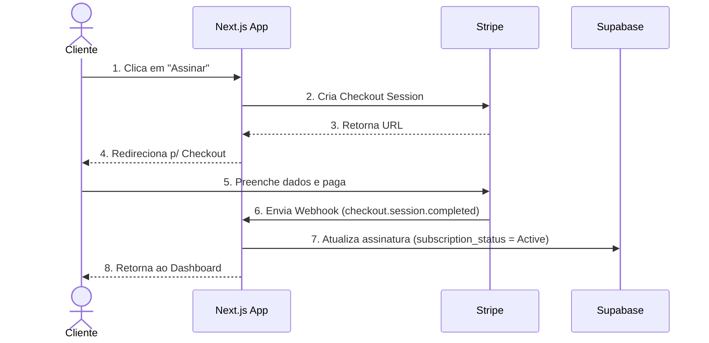
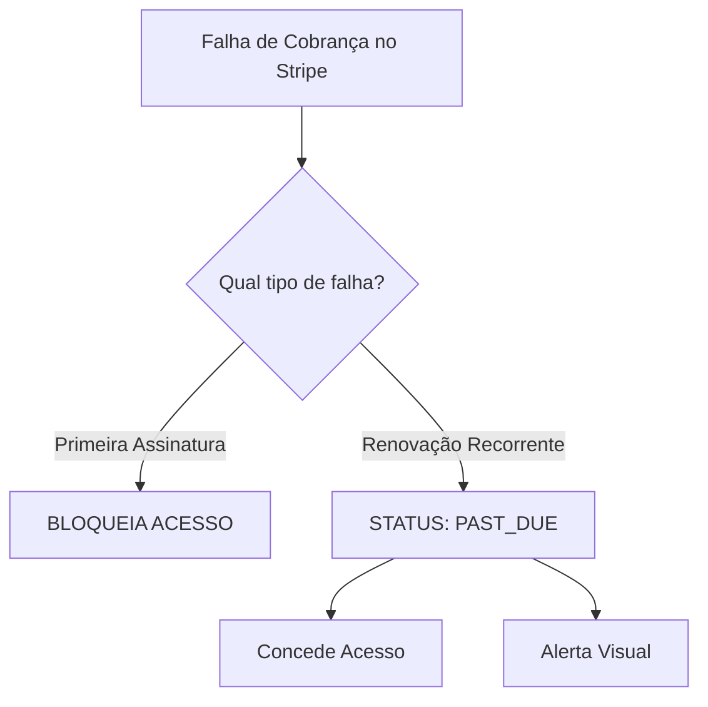

**Stack:** Next.js (App Router) + Supabase (Auth & Database) + Stripe (Payments)

Este guia consolida as decisões arquiteturais, fluxos lógicos e estratégias de resiliência para a implementação do faturamento no sistema Orça Fácil utilizando o Stripe.

## 1. Visão Geral da Arquitetura e do Fluxo de Assinatura

O fluxo de dados baseia-se em uma arquitetura assíncrona orientada a eventos (Webhooks). O banco de dados do Supabase só libera o acesso após a confirmação de pagamento enviada pelo Stripe.



## 2. Estratégia de Trial Sem Cartão (15 dias grátis)

A própria aplicação (Supabase) controla os 15 dias de teste iniciais. Se o usuário decidir assinar a qualquer momento (seja no 5º ou no 15º dia), o checkout do Stripe é configurado para cobrar **imediatamente**.

A assinatura entra em vigor logo no momento do pagamento, sem herdar os dias restantes do período de teste.

### Exemplo de Código - Rota de Checkout (`/api/checkout`)

```
import { NextResponse } from 'next/server';
import Stripe from 'stripe';

const stripe = new Stripe(process.env.STRIPE_SECRET_KEY!, {
  apiVersion: '2023-10-16', // Ajuste para a versão utilizada
});

export async function POST(req: Request) {
  try {
    const { userId, email, stripeCustomerId } = await req.json();

    // Configuração recomendada (Stripe Best Practices): Omitir payment_method_types para permitir Dynamic Payment Methods 
    // configurados no Dashboard do Stripe (Pix, Boleto, Cartão de Crédito de forma automática e otimizada por país).
    const session = await stripe.checkout.sessions.create({
      customer: stripeCustomerId,
      line_items: [{ price: process.env.STRIPE_PRICE_ID_PRO!, quantity: 1 }],
      mode: 'subscription',
      success_url: `${process.env.NEXT_PUBLIC_APP_URL}/dashboard?session_id={CHECKOUT_SESSION_ID}`,
      cancel_url: `${process.env.NEXT_PUBLIC_APP_URL}/billing`,
      metadata: {
        supabase_user_id: userId,
      },
    });

    return NextResponse.json({ url: session.url });
  } catch (error: any) {
    return NextResponse.json({ error: error.message }, { status: 500 });
  }
}
```

## 3. Resiliência: Tratamento de Falhas Sistêmicas

Integrar sistemas financeiros requer mecanismos automáticos de auto-recuperação. Abaixo estão as soluções para as falhas mais comuns.

### Falha A: Criação do cliente no Stripe falha durante o cadastro

Se a chamada ao Stripe falhar ao criar o usuário no cadastro do Supabase, o sistema continua a operar de forma transparente usando a **Criação On-Demand (Sob Demanda)**.

- **Tratamento:** O campo `stripe_customer_id` no banco de dados fica como `NULL`. O usuário usa o trial normalmente (pois a data de trial está no Supabase). No dia em que clica em "Assinar", a rota da API verifica se o ID é nulo, cria o cliente no Stripe naquele exato momento, atualiza o banco de dados e gera o Checkout em seguida.
    

### Falha B: O Webhook do Stripe falhou ou o servidor Next.js caiu

Para garantir que o cliente não pague e fique bloqueado na tela de carregamento, implementa-se um **Mecanismo de Dupla Validação**:

1. **Camada de Retentativas do Stripe:** O Stripe tentará reenviar automaticamente o mesmo webhook com um espaçamento de tempo (Backoff Exponencial) por até 3 dias.
    2. **Validação na Página de Sucesso:** Quando o cliente é redirecionado para `/app?session_id=cs_123...`:
    
    No Server Component `/app/page.tsx`, interceptamos o `session_id` e validamos com o Stripe caso o webhook não tenha atualizado o banco ainda:
    
    ```typescript
    // Em app/app/page.tsx:
    const params = await searchParams
    const sessionId = typeof params?.session_id === 'string' ? params.session_id : undefined
    
    if (sessionId) {
      const { data: currentProfile } = await supabase.from('profiles').select('subscription_status').eq('id', user.id).single()
      if (currentProfile?.subscription_status !== 'active') {
        const session = await stripe.checkout.sessions.retrieve(sessionId)
        if (session.payment_status === 'paid' || session.status === 'complete') {
          await supabaseAdmin.rpc('update_profile_subscription', {
            p_stripe_customer_id: session.customer as string,
            p_subscription_status: 'active',
            p_subscription_id: session.subscription as string,
            p_cancel_at_period_end: false,
          })
          redirect('/app')
        }
      } else {
        redirect('/app')
      }
    }
    ```
        

## 4. Cancelamento de Assinatura Sem Perda de Dias Restantes

Ao solicitar o cancelamento, o cliente não deve ter o acesso bloqueado imediatamente se ele ainda tiver dias vigentes pagos.

### A Estratégia de Rastreamento Robusto (`cancel_at_period_end` + `cancel_at`)

No Stripe, o agendamento de um cancelamento futuro é modelado através de duas propriedades complementares:
1.  **`cancel_at_period_end`** (boolean): Indica se a assinatura será cancelada especificamente ao fim do período de faturamento atual.
2.  **`cancel_at`** (unix timestamp): A data e hora exatas em que a assinatura será efetivamente cancelada e o acesso bloqueado. 

**Resiliência no Webhook:** Para total cobertura de casos onde o Stripe agenda cancelamentos por timestamp de encerramento (`cancel_at`) sem alterar o flag de período diretamente, avaliamos que a assinatura está agendada para cancelamento se `cancel_at_period_end == true` **OU** se `cancel_at != null`.

- **Fluxo lógico:**
    
    1. O cliente clica em cancelar ➔ O Stripe define a data de cancelamento e dispara o webhook `customer.subscription.updated`.
        
    2. No webhook, convertemos o timestamp UNIX de `subscription.cancel_at` para string ISO e passamos para a RPC:
        ```typescript
        const cancelAt = subscription.cancel_at
          ? new Date(subscription.cancel_at * 1000).toISOString()
          : null;
        
        // E salvamos o status agendado de forma resiliente
        const p_cancel_at_period_end = subscription.cancel_at_period_end || subscription.cancel_at !== null;
        ```
        
    3. O Supabase persiste `cancel_at_period_end` e `cancel_at`.
        
    4. O Next.js mantém o acesso liberado porque o status ainda é `'active'`.
        
    5. **UX Premium:** A interface lê as colunas e exibe uma contagem regressiva amigável:
        ```typescript
        const cancelDate = profile?.cancel_at ? new Date(profile.cancel_at) : null;
        const daysRemaining = cancelDate ? Math.max(0, Math.ceil((cancelDate.getTime() - now.getTime()) / (1000 * 60 * 60 * 24))) : 0;
        
        // Renderiza banner
        if (cancelDate) {
          return <div>Sua assinatura Pro termina em {cancelDate.toLocaleDateString()} ({daysRemaining} dias restantes). Reative para manter seus dados.</div>
        }
        ```
        
    6. No dia do vencimento, o Stripe encerra e dispara `customer.subscription.deleted`. O webhook atualiza o status para `canceled`, limpa os campos de cancelamento, e o acesso é finalmente bloqueado.
        

## 5. Gestão de Falhas de Pagamento (Dunning e `past_due`)

É necessário tratar de formas totalmente diferentes a falha na **primeira compra** e a falha em uma **renovação recorrente**.



### Cenário A: Primeira Assinatura

O trial acabou e a primeira tentativa de pagamento falhou. O usuário **não deve** ter acesso. O status fica como `incomplete`.

### Cenário B: Renovação de Assinatura Existente

O cliente já é ativo, mas na renovação o cartão foi recusado. O Stripe entra em modo de cobrança inteligente (Dunning), fazendo até 4 tentativas automáticas de cobrança em datas futuras.

- Durante o período de dunning, o status da assinatura no Stripe muda para **`past_due`**.
    
- **Melhor Prática (Colher de Chá):** Conceda acesso temporário ao usuário. Exiba apenas um banner de aviso: _"Problema na renovação do seu pagamento. Atualize os seus dados para evitar bloqueios"_. Se após todas as tentativas o pagamento falhar, o status passa para `unpaid`/`canceled` e o bloqueio é efetuado.
    

### Lógica de Controle de Acesso (Next.js Middleware(proxy)/Server Component)

```
interface UserProfile {
  subscription_status: string;
  trial_ends_at: string;
}

export function hasAccess(profile: UserProfile): { allowed: boolean; bannerType: 'none' | 'past_due' } {
  const now = new Date();
  const isTrialValid = now < new Date(profile.trial_ends_at);

  // 1. Se está no período de trial, o acesso é garantido
  if (isTrialValid) {
    return { allowed: true, bannerType: 'none' };
  }

  // 2. Validação baseada no status do Stripe sincronizado no banco de dados
  switch (profile.subscription_status) {
    case 'active':
      return { allowed: true, bannerType: 'none' };
    
    case 'past_due':
      // Dá acesso mas avisa que o cartão falhou
      return { allowed: true, bannerType: 'past_due' }; 

    case 'incomplete':
    case 'canceled':
    case 'unpaid':
    default:
      return { allowed: false, bannerType: 'none' };
  }
}
```

## 6. Considerações de Segurança e Boas Práticas Avançadas

### Multi-Tenant

Cada usuário em `auth.users` no Supabase é um tenant, a tabela `public.profiles` estende a tabela de usuários.

- Salve o `stripe_customer_id` e o `subscription_status` na tabela `profiles`.
    

### Segurança de Banco com RLS (Supabase)

Mantenha as Row Level Security (RLS) extremamente blindadas.

- **Regra de Ouro:** O usuário do aplicativo **nunca** pode atualizar diretamente campos como `subscription_status`, `stripe_customer_id`, `subscription_id`, `trial_ends_at`, `cancel_at_period_end` ou `cancel_at` por requisições de cliente. Bloqueie operações de `UPDATE` nessas colunas para usuários comuns.
    
- **Comando SQL de Blindagem (REVOKE):**
  ```sql
  REVOKE UPDATE (stripe_customer_id, subscription_status, subscription_id, trial_ends_at, cancel_at_period_end, cancel_at) 
  ON public.profiles 
  FROM authenticated, anon;
  ```
    
- **Atualização Segura:** O Webhook do Stripe e as rotas de dupla validação no Next.js devem interagir com o Supabase utilizando a **`Service Role Key`** (chave administrativa secreta). Esta chave roda apenas em ambiente isolado no backend e ignora as regras de segurança/permissão de RLS do banco de dados.

### Exclusão de Conta (LGPD / Churn)

Se o usuário solicitar a exclusão definitiva da conta de dentro do seu painel:

- **Procedimento obrigatório:** Antes de deletar a conta do Supabase Auth, o seu backend Next.js deve obrigatoriamente fazer uma chamada de API ao Stripe e cancelar/deletar o cliente do Stripe (`stripe.customers.del`). Se não fizer isso, o usuário continuará a ser cobrado mensalmente mesmo sem ter como acessar o sistema para cancelar.

---

## 7. Histórico de Versões

| Versão | Data | Autor | Descrição |
| :--- | :--- | :--- | :--- |
| `v1.0.0` | 2026-05-26 | João Paulo | Especificação inicial da arquitetura de faturamento. |
| `v1.1.0` | 2026-05-29 | Antigravity AI | Adicionado bloqueio de colunas por RLS (REVOKE), dupla validação de `session_id` no Server Component, rastreamento do campo `cancel_at_period_end` no Supabase e Dynamic Payment Methods no checkout. |
| `v1.2.0` | 2026-05-29 | Antigravity AI | Adicionado suporte a `cancel_at` (timestamp) no banco de dados e webhook para exibição de contagem regressiva e mensagens personalizadas na UI de cancelamento de assinatura. |