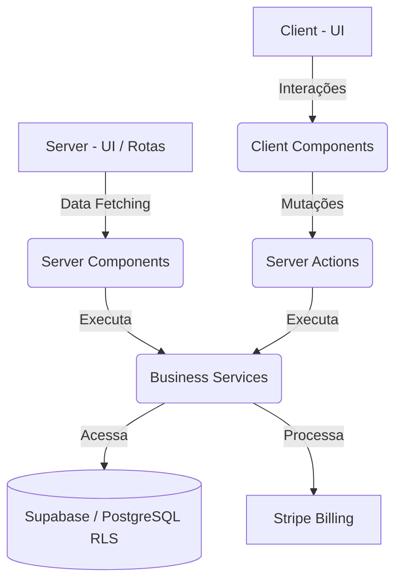

# 🚀 Orca Fácil - Plataforma Inteligente de Orçamentos e Gestão

O **Orca Fácil** é uma plataforma SaaS moderna e de alta performance projetada para simplificar a criação, envio e gestão de orçamentos para prestadores de serviços e empresas. A aplicação automatiza fluxos de trabalho, gerencia clientes, catálogos de produtos e serviços, monitora o status de propostas comerciais e integra pagamentos de forma transparente.

---

## 🛠️ Stack Tecnológica

O projeto foi construído utilizando tecnologias modernas de nível empresarial, garantindo escalabilidade, segurança e excelente experiência do desenvolvedor:

### **Frontend & Core**
*   **React 19** – A versão estável mais recente, aproveitando os novos recursos de concorrência e hooks avançados.
*   **Next.js 16 (App Router)** – Framework React com renderização híbrida (SSR, SSG, ISR), roteamento otimizado baseado em arquivos e Server Components por padrão.
*   **TypeScript** – Tipagem estática rigorosa para prevenção de bugs em tempo de compilação.

### **Estilização & Design System**
*   **Tailwind CSS v4** – Otimizado para performance extrema, usando a nova engine CSS do Tailwind e variáveis de tema nativas, sem valores arbitrários soltos (*anti-magic values*).
*   **shadcn/ui** – Componentes de interface primitivos e acessíveis, totalmente customizáveis e estilizados via classes utilitárias do Tailwind.
*   **Lucide React** – Conjunto rico de ícones modernos e minimalistas.
*   **Recharts** – Criação de painéis visuais e gráficos responsivos para análise financeira e métricas de conversão.
*   **Embla Carousel & Vaul** – Componentes avançados de navegação e gavetas deslizantes (*drawers*) fluidas.

### **Formulários & Validação**
*   **React Hook Form** – Gerenciamento de estado de formulários performático com renderizações mínimas.
*   **Zod** – Validação de esquemas e inferência de tipos robusta, garantindo a integridade dos dados tanto no cliente quanto no servidor.
*   **@hookform/resolvers** – Integração transparente entre Zod e React Hook Form.

### **Backend, Banco de Dados & Infraestrutura (BaaS)**
*   **Supabase** – Backend-as-a-Service (BaaS) alimentado por **PostgreSQL**.
    *   **Supabase Auth & SSR** – Autenticação segura por cookies implementada via `@supabase/ssr`.
    *   **Row Level Security (RLS)** – Regras de segurança no banco de dados para isolamento absoluto de dados entre tenants.
    *   **Supabase Client/Server Clients** – Conexão otimizada no lado do cliente e em Server Components.
*   **Stripe** – Gateway de pagamentos integrado para gerenciamento de assinaturas, planos recorrentes e faturamento de clientes.

### **Gerenciamento de Dados & Manipulação de UI**
*   **TanStack Table v8 (@tanstack/react-table)** – Gerenciamento e renderização de tabelas de dados robustas com paginação, filtros e ordenação nativa.
*   **dnd-kit** – Suíte modular de arrastar e soltar (Drag and Drop) para reordenação de itens de orçamento de forma interativa.

---

## 🏛️ Arquitetura de Software e Boas Práticas

O projeto segue rigorosos princípios de **Clean Code**, **SOLID** e as melhores convenções de desenvolvimento do ecossistema Next.js/React.



### 1. Separação de Responsabilidades (SRP)
*   **Componentes de UI vs Lógica de Negócio**: Componentes visuais mantêm o foco estrito na renderização. Toda e qualquer regra de negócio complexa é delegada para serviços puros.
*   **Camada de Serviços (Services Pattern)**: Localizada em `lib/services/`, é a única responsável pelas regras de negócio e persistência no banco de dados (ex: `UserService`).

### 2. Next.js 16 Server Components & Server Actions
*   **Server Components por Padrão**: Toda página (`page.tsx`) e layout (`layout.tsx`) é tratada como Server Component para maximizar a performance de carregamento inicial e otimizar o SEO. A marcação `"use client"` é restrita exclusivamente aos nós da árvore onde a interatividade (estados locais, efeitos colaterais) é indispensável.
*   **Server Actions Seguras**: Mutações de dados são executadas diretamente via Server Actions de forma extremamente segura. Cada Action é tratada como um endpoint de API tradicional: executa validação da sessão do usuário no servidor e valida a entrada de dados contra um esquema Zod antes de qualquer execução.

### 3. Segurança Multi-Tenant de Ponta a Ponta (*Security-First*)
*   **Row Level Security (RLS)**: Todas as tabelas do banco de dados no Supabase possuem políticas RLS ativas. O acesso direto às linhas é validado pelo token JWT do usuário, prevenindo vazamentos acidentais.
*   **Validação de Data Ownership**: O backend nunca confia cegamente nos IDs enviados pelo cliente. Antes de atualizar ou deletar qualquer registro, o sistema valida rigorosamente se o usuário autenticado é o real proprietário (owner) ou possui permissão de escrita para o `tenant_id` correspondente (*Fail-Safe Defaults*).
*   **Gestão de Segredos**: Ausência completa de chaves privadas ou credenciais no código-fonte (*hardcoded*). Todas as integrações (Supabase Admin, Stripe Secret Keys) usam variáveis de ambiente gerenciadas de forma segura.

### 4. Padrões de Código e Legibilidade
*   **TypeScript Estrito**: Uso estrito do compilador do TypeScript, proibindo expressamente a utilização do tipo `any` para evitar fragilidades na tipagem do código.
*   **Convenção de Nomenclatura**: Todo o código fonte (variáveis, classes, funções e comentários de arquitetura) está em **Inglês**.
    *   Booleans utilizam prefixos autoexplicativos como `is`, `has`, `should` ou `can` (ex: `isActive`, `hasPermission`).
    *   Funções sempre começam com verbos de ação claros (ex: `calculateTotals`, `fetchUserProfile`).
*   **Fail Fast e Early Returns**: Funções tratam erros e desvios rapidamente no início de sua execução, reduzindo o aninhamento desnecessário de ifs (*Callback Hell* ou estruturas piramidais).

---

## 📂 Estrutura de Diretórios

A estrutura de pastas reflete a arquitetura limpa adotada pelo projeto:

```text
├── .agents/               # Configurações e diretrizes de agentes autônomos
├── app/                   # Roteamento baseado no Next.js App Router
│   ├── (auth)/            # Grupos de rotas para autenticação (Login, Registro)
│   ├── app/               # Painel interno e áreas autenticadas do sistema
│   │   ├── admin/         # Painel administrativo
│   │   ├── catalog/       # Gestão do catálogo de produtos/serviços
│   │   ├── customers/     # CRM simplificado para gestão de clientes
│   │   ├── quotes/        # Geração e acompanhamento de orçamentos
│   │   ├── settings/      # Configurações de perfil, conta e cobrança
│   │   └── components/    # Componentes de UI exclusivos do dashboard
│   ├── api/               # Endpoints de API e Webhooks (ex: Stripe)
│   ├── globals.css        # Estilos globais e configurações do Tailwind CSS v4
│   └── layout.tsx         # Layout raiz do projeto
├── components/            # Componentes visuais reutilizáveis em toda a aplicação
│   ├── ui/                # Componentes primitivos do Design System (shadcn/ui)
│   └── ...                # Componentes de negócio (ex: app-sidebar, quote-viewer)
├── hooks/                 # Hooks React customizados para reutilização de lógica
├── lib/                   # Biblioteca de utilidades e integrações de terceiros
│   ├── services/          # Serviços com a regra de negócio da aplicação (ex: user-service)
│   ├── supabase/          # Configuração dos clientes do Supabase (Client, Server, Admin)
│   ├── validations/       # Esquemas de validação de dados usando o Zod
│   ├── stripe.ts          # Configuração do SDK e utilitários do Stripe
│   └── utils.ts           # Utilitários compartilhados (como fusão de classes Tailwind)
├── public/                # Arquivos estáticos (imagens, ícones, fontes)
├── supabase/              # Migrações, sementes e esquemas do Supabase local
├── types/                 # Definições globais de tipos do TypeScript
└── package.json           # Dependências e scripts de execução do projeto
```

---

## 🚀 Como Começar

### Pré-requisitos
Certifique-se de possuir instalado em sua máquina:
*   [Node.js](https://nodejs.org/) (v18.x ou superior, recomendado v20+)
*   [Stripe CLI](https://stripe.com/docs/stripe-cli) (para desenvolvimento local de pagamentos)

### Instalação

1.  Clone este repositório para o seu ambiente local:
    ```bash
    git clone https://github.com/seu-usuario/orca-facil.git
    cd orca-facil
    ```

2.  Instale as dependências de desenvolvimento:
    ```bash
    npm install
    ```

3.  Configure suas variáveis de ambiente:
    Crie um arquivo `.env.local` na raiz do projeto e configure as credenciais necessárias:
    ```env
    NEXT_PUBLIC_SUPABASE_URL=seu_supabase_url
    NEXT_PUBLIC_SUPABASE_ANON_KEY=sua_supabase_anon_key
    SUPABASE_SERVICE_ROLE_KEY=sua_supabase_service_role_key
    STRIPE_SECRET_KEY=sua_stripe_secret_key
    STRIPE_WEBHOOK_SECRET=seu_stripe_webhook_secret
    NEXT_PUBLIC_STRIPE_PUBLISHABLE_KEY=sua_stripe_publishable_key
    ```

### Executando o Projeto

*   **Iniciar servidor de desenvolvimento:**
    ```bash
    npm run dev
    ```
    A aplicação estará disponível em `http://localhost:3000`.

*   **Iniciar escuta de Webhooks do Stripe:**
    Para sincronizar eventos locais do Stripe (como assinaturas confirmadas) com seu backend:
    ```bash
    npm run stripe:listen
    ```

*   **Sincronizar Tipos do Supabase:**
    Gere os tipos do TypeScript baseados no banco de dados Supabase:
    ```bash
    npm run types
    ```

---

## 🔒 Licença

Este projeto é de uso privado e confidencial. Todos os direitos reservados.
