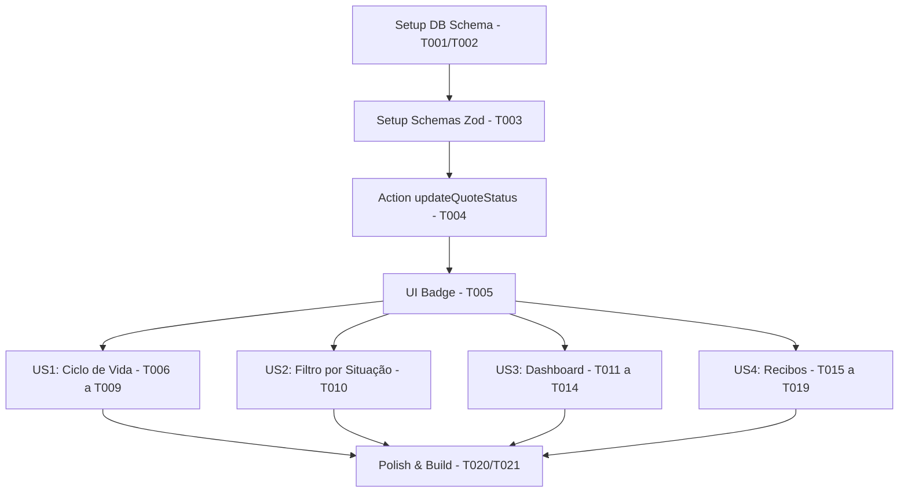

# Tasks: Melhorias no Ciclo de Vida de Orçamentos, Dashboard Administrativo e Recibos

**Input**: Design documents from `specs/001-budget-lifecycle-dashboard/`

**Prerequisites**: plan.md (required), spec.md (required), research.md, data-model.md, contracts/receipts.md, quickstart.md

**Organization**: As tarefas são agrupadas por user story para permitir a implementação e validação independente de cada entrega.

---

## Phase 1: Setup (Shared Infrastructure)

**Purpose**: Inicialização da infraestrutura do banco de dados e migrações necessárias para a feature.

- [x] T001 Criar o script de migração SQL em `supabase/migrations/20260603000000_budget_lifecycle_improvements.sql` contendo a coluna de motivo de cancelamento, a nova check constraint de status, a recriação da view de expiração e a estrutura da tabela de recibos com RLS.
- [x] T002 Aplicar a migração DDL/DML criada no console SQL do Supabase.

---

## Phase 2: Foundational (Blocking Prerequisites)

**Purpose**: Infraestrutura lógica e regras básicas no backend que bloqueiam todas as demais histórias de usuário.

- [x] T003 [P] Atualizar as definições de status e schemas Zod em `app/app/quotes/schemas.ts` com o novo domínio de status (`draft`, `pending`, `approved`, `rejected`, `cancelled`, `completed`) e os novos schemas de cancelamento.
- [x] T004 Atualizar a Server Action `updateQuoteStatus` em `app/app/quotes/actions.ts` para forçar validação de motivo no status `cancelled` e suportar os novos fluxos de transição.
- [x] T005 [P] Atualizar a UI do badge de status em `components/quote-status-badge.tsx` para mapear os novos status com cores condicionais e rótulos traduzidos.

**Checkpoint**: Fundação pronta - a implementação das telas e gráficos pode começar.

---

## Phase 3: User Story 1 - Ciclo de Vida do Orçamento (Priority: P1) 🎯 MVP

**Goal**: Permitir que o prestador de serviços gerencie as transições manuais do orçamento entre rascunho, pendente, aprovado, rejeitado, cancelado (com motivo) e concluído.

**Independent Test**: Criar um orçamento como rascunho, gerar para pendente, aprovar, e depois canc- [x] T006 [US1] Atualizar a lógica de exclusão física em `app/app/quotes/actions.ts` (na Server Action `deleteQuote`) para permitir a exclusão de registros exclusivamente com status `draft`.
- [x] T007 [US1] Atualizar a lógica do formulário de criação/edição e salvar em `app/app/quotes/actions.ts` para lidar com a transição de `draft` para `pending` ao clicar no botão "Gerar Orçamento".
- [x] T008 [US1] Implementar na página de visualização de detalhes do orçamento `app/app/quotes/[id]/page.tsx` e no visualizador `components/quote-viewer.tsx` as ações manuais permitidas de status e o diálogo popup para digitação de motivo de cancelamento.
- [x] T009 [US1] Adaptar as ações condicionais de listagem e menu de ações em `app/app/quotes/columns.tsx` de acordo com a situação de cada orçamento.

**Checkpoint**: Ciclo de vida funcional e testável de ponta a ponta.

---

## Phase 4: User Story 2 - Filtro por Situação na Lista (Priority: P1)

**Goal**: Filtrar e buscar orçamentos rapidamente na listagem de acordo com sua situação.

**Independent Test**: Acessar a tela de orçamentos, selecionar o status no filtro (ex: "Cancelado") e verificar se a tabela exibe apenas os registros com esse status.

- [x] T010 [P] [US2] Implementar filtros de tabulação/segmentação por situação no componente principal de listagem em `app/app/quotes/quotes-list.tsx`.

**Checkpoint**: Filtragem operacional na tela de listagem.

---

## Phase 5: User Story 3 - Painel Administrativo de Métricas (Priority: P2)

**Goal**: Disponibilizar um painel gerencial consolidando novos orçamentos, distribuição de status e faturamento faturado mensal.

**Independent Test**: Abrir a rota de painel gerencial `/app/app` (home do prestador) e verificar o carregamento de 3 gráficos consistentes com dados do banco.

- [x] T011 [P] [US3] Criar o componente de gráfico de pizza/rosca em `app/app/components/status-pie-chart.tsx` para apresentar a quantidade de orçamentos por situação.
- [x] T012 [P] [US3] Criar o componente de gráfico de barras em `app/app/components/revenue-bar-chart.tsx` para apresentar o faturamento mensal faturado consolidado.
- [x] T013 [US3] Ajustar a lógica do gráfico de linha em `app/app/components/quotes-chart.tsx` para agrupar e exibir a contagem de novos orçamentos criados.
- [x] T014 [US3] Atualizar a página inicial `app/app/page.tsx` para realizar a agregação segura das queries de faturamento e status no banco de dados e passar os dados consolidados para os três gráficos.

**Checkpoint**: Painel gerencial analítico funcional com gráficos integrados.

---

## Phase 6: User Story 4 - Geração de Recibo para Orçamentos Finalizados (Priority: P2)

**Goal**: Gerar recibos de quitação e exportar/imprimir em folha limpa sem cabeçalhos do app.

**Independent Test**: Abrir um orçamento com status "Finalizado", clicar em "Gerar Recibo", preencher a descrição dos serviços e testar a impressão nativa/PDF do recibo.

- [x] T015 [P] [US4] Desenvolver a camada de serviços em `lib/services/receipt-service.ts` contendo métodos para buscar, salvar e deletar recibos de quitação.
- [x] T016 [US4] Implementar as Server Actions de recibo em `app/app/quotes/receipt-actions.ts` validando propriedade do tenant do usuário antes do upsert.
- [x] T017 [US4] Desenvolver a página de formulário de emissão/edição de recibo em `app/app/quotes/[id]/receipt/edit/page.tsx` carregando valores padrão e permitindo digitação da descrição do serviço.
- [x] T018 [US4] Desenvolver a página de visualização de recibo em `app/app/quotes/[id]/receipt/page.tsx` contendo o layout do recibo (valores em destaque no topo, dados do cliente e linhas estáticas de assinaturas).
- [x] T019 [US4] Adicionar tags e classes do Tailwind de impressão (`print:hidden`, `print:p-0`, `print:shadow-none`) em `app/app/quotes/[id]/page.tsx` e `app/app/quotes/[id]/receipt/page.tsx` para otimizar a visualização em PDF/impressão nativa de orçamentos e recibos.

**Checkpoint**: Recibos emitidos, consultados e impressos com sucesso.

---

## Phase 7: Polish & Cross-Cutting Concerns

**Purpose**: Ajustes finais, higiene de código e validações finais de compilação.

- [x] T020 [P] Remover imports e variáveis não utilizadas, garantindo a higiene do código.
- [x] T021 Validar testes de builds locais do Next.js executando `npx tsc --noEmit` e `npm run build`.

---

## Dependencies & Execution Order



### Oportunidades de Paralelismo
*   Os desenvolvedores podem trabalhar em paralelo nas fases **US1**, **US2**, **US3** e **US4** assim que a fase **Foundational** (T003 a T005) for completada.
*   Dentro de cada fase, tarefas marcadas com `[P]` (como T011 e T012 no Dashboard, ou T015 nos Recibos) podem ser codificadas concorrentemente devido ao isolamento de arquivos.

---

## Parallel Example: User Story 3 & 4

```bash
# Desenvolvedor A constrói gráficos analíticos em paralelo:
Task: "Criar status-pie-chart.tsx em app/app/components/status-pie-chart.tsx"
Task: "Criar revenue-bar-chart.tsx em app/app/components/revenue-bar-chart.tsx"

# Desenvolvedor B inicia a infraestrutura do recibo em paralelo:
Task: "Desenvolver a camada de serviços em lib/services/receipt-service.ts"
```

---

## Implementation Strategy

### MVP First (Fase 1, 2 e US1 apenas)
1.  Complete a **Fase 1 (Setup)** executando o script SQL no Supabase.
2.  Complete a **Fase 2 (Foundational)** aplicando os schemas Zod e Server Actions atualizadas.
3.  Complete a **Fase 3 (User Story 1)** para obter um fluxo completo de transição de status na tela de detalhes de orçamentos.
4.  **Validar**: Teste manualmente a mudança do ciclo de vida em orçamentos rascunhos, ativos, cancelados com justificativa e concluídos.

### Incrementos Posteriores
1.  Adicione a filtragem de status (US2).
2.  Adicione os recibos (US4).
3.  Adicione o Painel analítico gerencial com gráficos integrados (US3).
