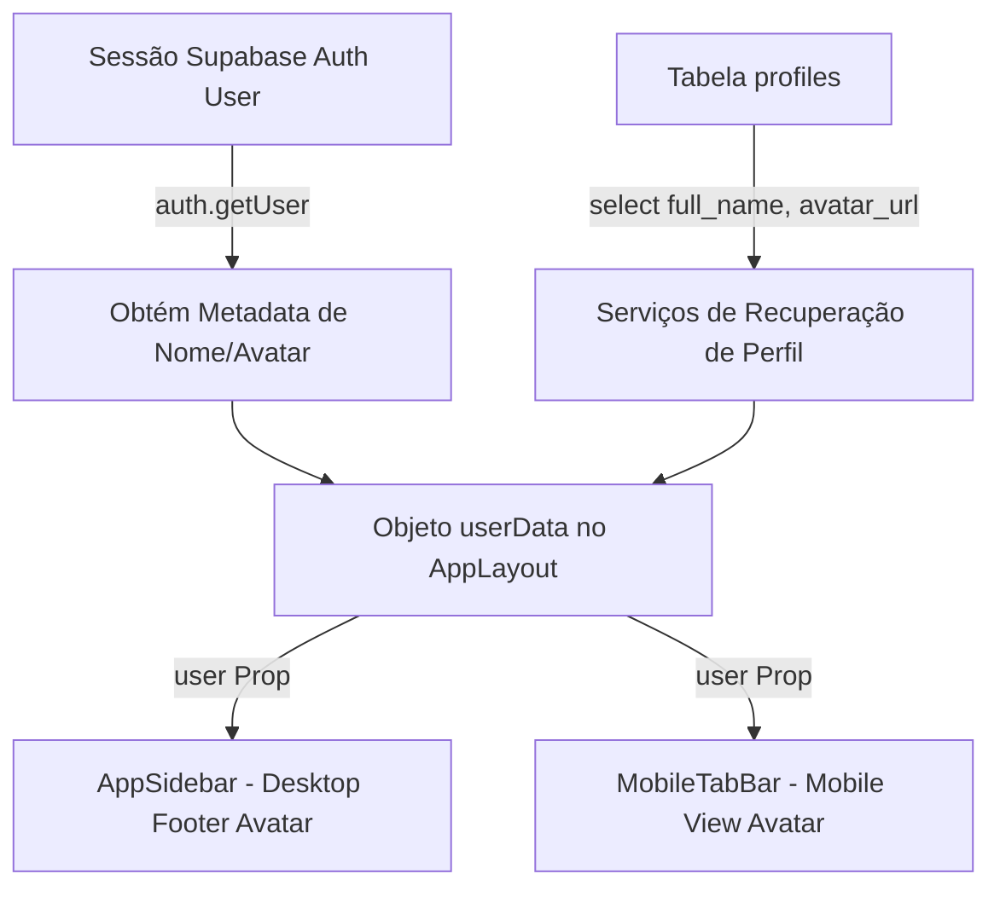

# Data Model Reference: Refatoração de Layout Estático

**Feature**: [spec.md](file:///c:/DEV/orcafacil/specs/003-static-layout-refactoring/spec.md)
**Date**: 2026-06-22

---

## Alterações de Esquema de Banco de Dados

> [!NOTE]
> Esta fase de refatoração do layout estático global **não introduz** nenhuma alteração de banco de dados, novas tabelas ou migrações no Supabase.

---

## Estruturas de Dados Lidas (Consulta)

Para a correta renderização do perfil do usuário na Sidebar (desktop) e na Tab Bar inferior (mobile), o sistema consome os seguintes dados existentes obtidos da sessão de autenticação e da tabela `profiles` do Supabase:

### Entidade `Profile` (Existente)

Representa os metadados cadastrais do usuário autenticado no sistema.

| Atributo | Tipo | Descrição |
|---|---|---|
| `full_name` | `string` | Nome completo do usuário. Caso seja nulo/curto, o sistema extrai a primeira inicial como fallback para renderização no avatar. |
| `avatar_url` | `string (URL)` | URL pública da imagem de perfil hospedada no bucket de armazenamento. Se nula, o avatar renderiza em formato fallback textual. |

### Fluxo de Dados

