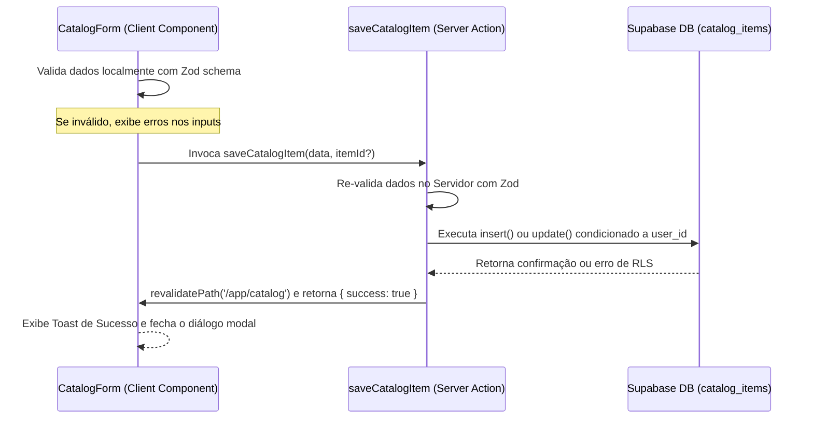

# Data Model & Validation Reference: Identidade Visual e Catálogo

Este documento descreve os esquemas de dados, regras de integridade e esquemas de validação do formulário no cliente para a correta persistência das informações do catálogo no Supabase.

---

## Esquema da Tabela Supabase: `catalog_items` (Existente)

Armazena as informações dos produtos e serviços oferecidos pelos prestadores cadastrados.

| Atributo | Tipo PostgreSQL | Tipo TypeScript | Descrição |
|---|---|---|---|
| `id` | `uuid` | `string` | Identificador único gerado automaticamente como chave primária. |
| `user_id` | `uuid` | `string` | ID do usuário proprietário do item do catálogo. Chave estrangeira que se conecta com a tabela de usuários da autenticação. |
| `name` | `text` | `string` | Nome legível do produto ou serviço (obrigatório). |
| `type` | `text` | `string` | Categoria do item. Deve ser estritamente `'product'` ou `'service'`. |
| `unit_price` | `numeric` | `number` | Preço de venda unitário do item (obrigatório, positivo). |
| `unit_measure` | `text` | `string \| null` | Métrica de medida associada (ex: `un`, `h`, `m²`). Aceita nulo. |
| `created_at` | `timestamp` | `string \| null` | Carimbo de data e hora de inserção automática. |

### Regras de Segurança (RLS - Row Level Security)
*   **Políticas de RLS**: Ativadas e configuradas para garantir isolamento absoluto.
*   **Permissões**: Um usuário autenticado pode apenas ler, inserir, atualizar ou excluir os itens onde `user_id` coincida exatamente com o seu ID obtido da sessão segura (`auth.uid()`).

---

## Esquema de Validação do Formulário (Zod)

Para garantir a qualidade dos dados inseridos no banco de dados e dar feedback visual imediato antes da persistência, o formulário de cadastro e edição no frontend é validado com o seguinte schema Zod no arquivo `app/app/catalog/catalog-form.tsx`:

```typescript
const catalogSchema = z.object({
  type: z.enum(['product', 'service'], {
    required_error: 'O tipo do item é obrigatório.',
  }),
  name: z.string()
    .min(2, 'O nome deve conter pelo menos 2 caracteres.')
    .max(100, 'O nome deve conter no máximo 100 caracteres.'),
  unit_price: z.coerce.number()
    .min(0.01, 'O valor unitário deve ser estritamente maior que zero.'),
  unit_measure: z.string()
    .max(10, 'A unidade de medida deve conter no máximo 10 caracteres.')
    .optional()
    .nullable()
    .or(z.literal('')), // Permite string vazia como opcional
})
```

---

## Fluxo de Mutações e Sincronização


