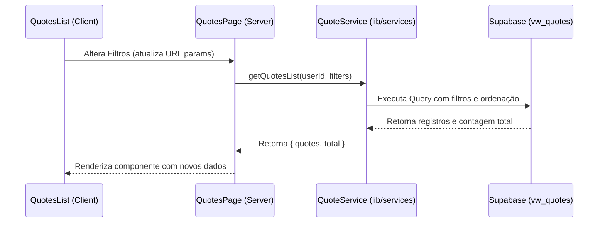

# Data Model & State Design: Redesign Quote List

## 1. Entities

### Quote (Orçamento)
A listagem exibe dados da entidade `Quote` consultados através da View `vw_quotes` para incluir informações consolidadas.

| Campo | Tipo | Descrição |
|-------|------|-----------|
| `id` | UUID | Identificador interno único do orçamento. |
| `quote_number` | Integer | Número sequencial formatado como código de exibição (ex: `ORC-001`). |
| `title` | String | Título ou descrição resumida do orçamento. |
| `customer_id` | UUID | Chave estrangeira relacionando o orçamento a um cliente. |
| `customer_name` | String | Nome do cliente associado ao orçamento (resolvido via relacionamento). |
| `total` | Numeric | Valor total calculado do orçamento. |
| `status` | Enum | Estado do ciclo de vida: `draft`, `pending`, `approved`, `rejected`, `cancelled`, `completed`, `expired`. |
| `created_at` | Timestamp | Data e hora de criação do orçamento no banco de dados. |

---

## 2. State Management (UI Filters)

O estado de busca, ordenação e filtragem é persistido na URL como parâmetros de query string (Query Params) para suportar compartilhamento de link e navegação de histórico consistente.

### FilterState (Estrutura do Estado)

```typescript
interface FilterState {
  search: string;      // Termo de busca livre (código, título ou nome do cliente)
  status: string[];    // Array de status selecionados (ex: ['draft', 'pending'])
  from: string;        // Data de início (formato 'YYYY-MM-DD')
  to: string;          // Data final (formato 'YYYY-MM-DD')
  sort: SortOption;    // Critério de ordenação
  limit: number;       // Quantidade de registros acumulados a exibir (paginação)
}

type SortOption = 'newest' | 'oldest' | 'highest_value' | 'lowest_value';
```

### URL Query Parameters Mapping

| Parâmetro URL | Mapeamento no Estado | Valor Padrão | Exemplo |
|---------------|----------------------|--------------|---------|
| `search` | `search` | `""` | `?search=ORC-10` |
| `status` | `status` (separado por vírgulas) | `all` | `?status=draft,pending` |
| `from` | `from` | `""` | `?from=2026-06-01` |
| `to` | `to` | `""` | `?to=2026-06-30` |
| `sort` | `sort` | `newest` | `?sort=highest_value` |
| `limit` | `limit` (acumulador do "Carregar Mais")| `10` | `?limit=20` |

---

## 3. Data Flow


