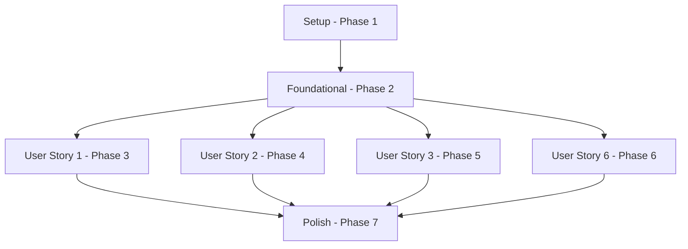

# Tasks: Reorganização do Formulário de Novo Orçamento

**Input**: Design documents from `/specs/009-improve-budget-form/`

**Prerequisites**: plan.md (required), spec.md (required for user stories), research.md, data-model.md, quickstart.md

**Organization**: As tarefas são agrupadas por user story para permitir a implementação independente de cada incremento.

## Format: `[ID] [P?] [Story] Description`

- **[P]**: Pode ser executado em paralelo (arquivos diferentes, sem dependências).
- **[Story]**: A qual história de usuário esta tarefa pertence (ex: US1, US2, US3, US4).
- O caminho exato do arquivo é incluído na descrição de cada tarefa.

---

## Phase 1: Setup (Shared Infrastructure)

**Purpose**: Preparação de tipos e infraestrutura básica do projeto.

- [x] T001 [P] Atualizar definições de tipo e interfaces para `QuoteItem` e `Quote` em types/quote.ts

---

## Phase 2: Foundational (Blocking Prerequisites)

**Purpose**: Ajustes nas definições de validação e processamento no backend que servem de base para o formulário.

- [x] T002 [P] Remover os campos `discount_type` e `discount_value` do schema de validação `quoteItemSchema` em app/app/quotes/schemas.ts
- [x] T003 [P] Ajustar a server action `saveQuote` em app/app/quotes/actions.ts para enviar `discount_type: 'none'` e `discount_value: 0` para cada item enviado à RPC `upsert_quote_with_items`, adaptando para o novo schema sem descontos individuais.

**Checkpoint**: Infraestrutura pronta - a implementação das histórias de usuário no formulário pode ser iniciada.

---

## Phase 3: User Story 1 - Seções Recolhíveis (Priority: P1) 🎯 MVP

**Goal**: Permitir que o usuário colapse e expanda seções do formulário e visualize itens de forma compacta para otimizar o foco e legibilidade em dispositivos móveis e desktop.

**Independent Test**: Carregar a página `/app/quotes/new` e testar a expansão/colapso de cada cabeçalho de seção (Dados do Orçamento e Itens do Orçamento abrem expandidos por padrão, as demais abrem recolhidas). Certificar que cada item novo inserido se comporta como colapsável e inicia recolhido por padrão.

### Implementation for User Story 1

- [x] T004 [US1] Adicionar imports do componente `Collapsible` do Base UI ou Shadcn e definir os estados de aberto/fechado para as quatro seções em app/app/quotes/components/quote-form.tsx
- [x] T005 [US1] Reorganizar ordem dos campos principais da seção "Dados do orçamento" para a ordem Cliente, Validade, Título em app/app/quotes/components/quote-form.tsx
- [x] T006 [US1] Envolver as seções "Dados do orçamento", "Itens do orçamento", "Formas de pagamento" e "Termos e condições" em componentes `Collapsible` em app/app/quotes/components/quote-form.tsx
- [x] T007 [P] [US1] Criar novo componente `QuoteItemRow` em app/app/quotes/components/quote-item-row.tsx para representar uma linha de item da lista com estado local de colapso/expansão suave.
- [x] T008 [US1] Atualizar renderização da lista de itens na seção "Itens do orçamento" usando o componente `QuoteItemRow` para que iniciem recolhidos por padrão em app/app/quotes/components/quote-form.tsx

**Checkpoint**: O formulário é agora composto de seções colapsáveis, e os itens inseridos são listados de forma compacta e individualmente colapsáveis.

---

## Phase 4: User Story 2 - Adição e Visualização Estruturada de Itens sem Desconto Individual (Priority: P1)

**Goal**: Otimizar a inserção de itens usando um Sheet lateral unificado (catálogo com seleção múltipla/em lote ou manual) e remover o desconto por item individual para evitar duplicidade.

**Independent Test**: Abrir o Sheet lateral ao clicar no botão "Adicionar item", pesquisar e selecionar múltiplos itens do catálogo, confirmar e verificar que foram adicionados corretamente à tabela. Validar que não existe campo ou menção a desconto individual em nenhuma parte do formulário ou dos itens da lista.

### Implementation for User Story 2

- [x] T009 [US2] Remover toda a lógica, campos e cálculos de desconto por item em app/app/quotes/components/quote-form.tsx e app/app/quotes/components/quote-item-row.tsx
- [x] T010 [US2] Implementar visualização da lista de itens em formato de tabela/lista compacta com cabeçalho fixo no desktop (Descrição, Qtd., Valor Unitário, Total) e campos de edição alinhados em linha única ao expandir o item em app/app/quotes/components/quote-item-row.tsx
- [x] T011 [US2] Criar e configurar o Sheet lateral (Drawer) para a adição de itens em app/app/quotes/components/quote-form.tsx
- [x] T012 [US2] Implementar busca no catálogo com checkboxes de seleção múltipla e botão para adicionar em lote em app/app/quotes/components/quote-form.tsx
- [x] T013 [US2] Substituir os botões de adicionar por um único botão de adicionar item que abre o Sheet em app/app/quotes/components/quote-form.tsx

**Checkpoint**: A adição de itens é feita através de painel lateral com inserção múltipla do catálogo e sem desconto por item.

---

## Phase 5: User Story 3 - Fluxo Dedicado para Formas de Pagamento e Termos (Priority: P2)

**Goal**: Mover o preenchimento de formas de pagamento e termos para painéis laterais dedicados, simplificando a tela principal do formulário.

**Independent Test**: Abrir os painéis laterais de formas de pagamento e termos, marcar múltiplas formas (ou digitar os termos), salvar e ver as formas de pagamento renderizadas como chips na tela principal e os termos exibidos de forma resumida.

### Implementation for User Story 3

- [x] T014 [US3] Criar o Sheet lateral para formas de pagamento em app/app/quotes/components/quote-form.tsx exibindo checkboxes com nome e ícone de cada forma de pagamento disponível.
- [x] T015 [US3] Exibir as formas de pagamento selecionadas como chips removíveis na tela principal em app/app/quotes/components/quote-form.tsx
- [x] T016 [US3] Criar o Sheet lateral para termos e condições contendo o `RichTextEditor` em app/app/quotes/components/quote-form.tsx
- [x] T017 [US3] Exibir resumo ou prévia do editor de termos e condições na tela principal com botão para abrir o Sheet em app/app/quotes/components/quote-form.tsx

**Checkpoint**: Os fluxos secundários de pagamento e termos estão isolados nos Sheets, deixando a tela principal limpa.

---

## Phase 6: User Story 4 - Resumo Fixo do Orçamento e Desconto Geral (Priority: P2)

**Goal**: Garantir a visualização constante do resumo financeiro durante o preenchimento do formulário e simplificar a configuração do desconto geral pelo resumo.

**Independent Test**: Redimensionar a tela para desktop e mobile, verificando o resumo fixo lateral no desktop e fixo inferior no mobile. Clicar no ícone de desconto no resumo, preencher o desconto geral no Sheet lateral e certificar-se de que os valores totais recalculam imediatamente.

### Implementation for User Story 4

- [x] T018 [US4] Configurar o layout do resumo fixo na lateral direita em desktop (layout de 2 colunas com `sticky top-24 self-start`) em app/app/quotes/components/quote-form.tsx
- [x] T019 [US4] Configurar o resumo fixado no rodapé em mobile (`fixed bottom-0 left-0 right-0 z-50 bg-card border-t`) e adicionar padding inferior de compensação na tela em app/app/quotes/components/quote-form.tsx
- [x] T020 [US4] Criar o Sheet lateral para configuração do desconto geral (tipo `%` ou `R$` e valor) com validação de limites contra o subtotal do orçamento em app/app/quotes/components/quote-form.tsx
- [x] T021 [US4] Modificar o ícone de desconto no resumo para abrir o Sheet lateral, melhorando sua acessibilidade e ampliando a área de toque em app/app/quotes/components/quote-form.tsx

**Checkpoint**: Resumo do orçamento fixo e acessível em todas as resoluções, permitindo alterar o desconto geral a qualquer momento.

---

## Phase 7: Polish & Cross-Cutting Concerns

**Purpose**: Limpeza de código, compatibilidade e validações finais de usabilidade.

- [x] T022 [P] Revisar e organizar importações, removendo logs de console e códigos mortos em app/app/quotes/components/quote-form.tsx e componentes criados.
- [x] T023 Validar o comportamento responsivo, acessibilidade de foco do teclado e área de toque WCAG (mínimo 44x44px no mobile) nos navegadores simulados.
- [x] T024 Testar fluxo completo de ponta a ponta para a geração de novos orçamentos, validando o re-cálculo e o salvamento sem descontos individuais de itens no banco de dados.

---

## Dependencies & Execution Order

### Phase Dependencies

- **Phase 1 (Setup)**: Sem dependências, inicia imediatamente.
- **Phase 2 (Foundational)**: Bloqueia todas as fases subsequentes, depende do Setup.
- **Phase 3, 4, 5, 6 (User Stories)**: Podem ser executadas em paralelo após a conclusão do Setup e Foundations, contudo a ordem de prioridade sugerida é incremental: US1 → US2 → US3 → US4.
- **Phase 7 (Polish)**: Depende da conclusão de todas as histórias de usuário.

---

## Implementation Strategy

### MVP First (User Story 1 & 2)
1. Concluir Setup e Foundations.
2. Implementar a colapsabilidade das seções (US1).
3. Implementar a tabela estruturada e remoção de desconto de itens, juntamente com o Sheet lateral para adição simples de itens (US2).
4. **Validar MVP**: Testar o fluxo de inserção de itens sem descontos em seções colapsáveis.

### Incremental Delivery
1. Adicionar o Sheet lateral de Formas de Pagamento e Termos (US3).
2. Adicionar o layout fixo de resumo responsivo e o Sheet do desconto geral (US4).
3. Realizar o polimento visual e cross-cutting (Phase 7).
